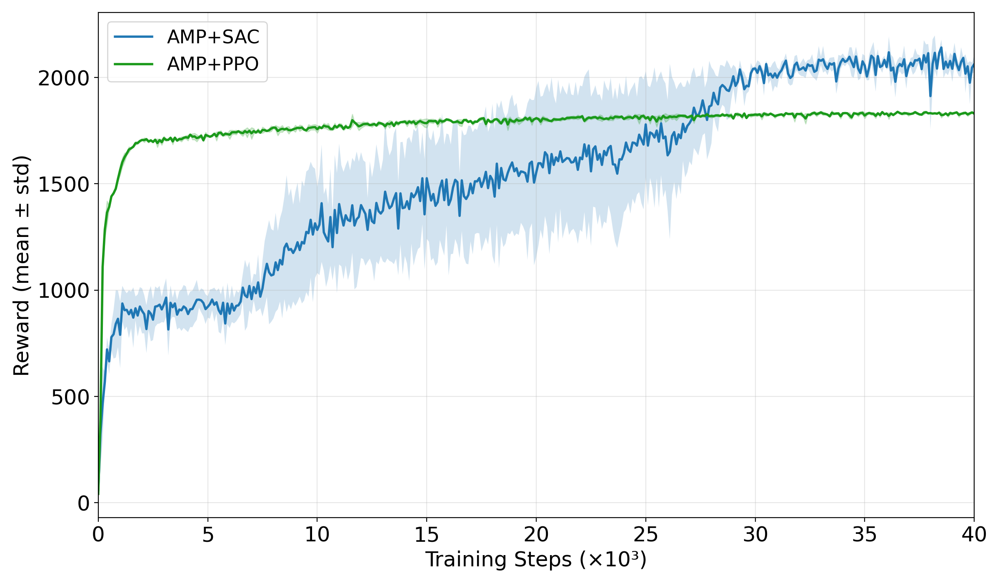
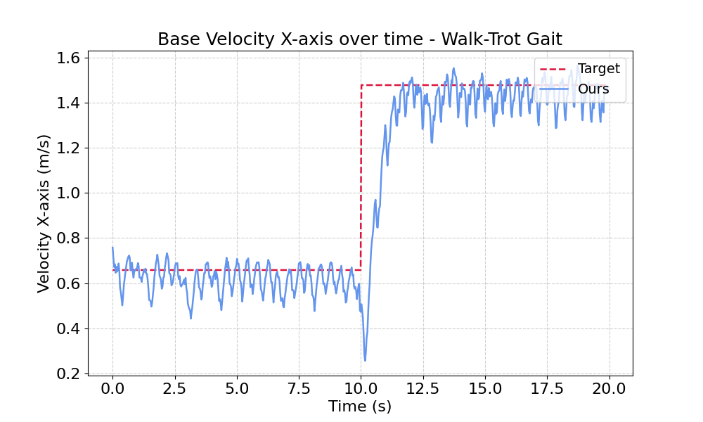

# WiML_adversarial_unleashed

"Adversarial Priors Unleashed with Soft Actor Critic" for WiML Workshop NeuroIPS 2025

This repository contains the implementation (will be released in soon) and results of our framework for **Adversarial Motion Priors (AMP)** combined with **Soft Actor-Critic (SAC)**, compared against **AMP + PPO**. The goal is to train quadruped robots to imitate animal-like motions.

Check out the full publication: [Unlocking the Potential of Soft Actor-Critic for Imitation Learning](https://arxiv.org/pdf/2509.24539)

---

## Motivation
- **Bio-inspired locomotion**: Robots can learn motor skills by imitating animal motions through reward-driven mechanisms.  
- **Limitations of prior work**: Most approaches combine Adversarial Motion Priors (AMP) with PPO [1], which relies on short-horizon rollouts and limits discriminator feedback.  
- **Our contribution**: We integrate AMP with Soft Actor–Critic (SAC) [2], enabling:  
  - Reuse of past trajectories via off-policy learning  
  - Better incorporation of discriminator feedback  
  - Improved stability, efficiency, and motion realism compared to PPO-based methods 
---

## Approach
- **AMP (Adversarial Motion Priors):** Guides the policy to match reference motions from animal/human datasets.  
- **SAC (Soft Actor-Critic):** Provides improved exploration and stability in continuous action spaces compared to PPO.
- **Retargeted Dataset**: Walking and Trotting gait from [3]
- **Evaluation Metrics:** Base height, forward velocity tracking, discriminator reward.  
- **Robots:** Trained and tested on the Unitree Go2 quadruped (IsaacGym).  

---

## Results

### 1. Reward Discriminator
  
- **SAC:** Achieves significantly higher discriminator rewards, indicating closer imitation of reference motions.  
- **PPO:** Lower discriminator reward, reflecting less convincing imitation.  

### 2. Total Reward 
  
- **SAC:** Achieves significantly higher discriminator rewards, indicating closer imitation of reference motions.  
- **PPO:** Lower discriminator reward, reflecting less convincing imitation.  

### 2. Forward Velocity Tracking
 
-  Temporal Evolution of X-Velocity During Walk–Gait Transition 

---

## Locomotion Demonstrations

- **SAC + AMP**  

- **PPO + AMP**  

---

## Key Takeaways
- **SAC + AMP outperforms PPO + AMP** in terms of:
  - Motion realism (discriminator rewards)  
  - Progressive velocity tracking  
  - Stability during training and evaluation  

## References
- [1] A Escontrela, X.B Peng, W Yu, T Zhang, A Iscen, K Goldberg, and P Abbeel. Adversarial motion priors
make good substitutes for complex reward functions. In IEEE/RSJ IROS, 2022. https://github.com/escontra/AMP_for_hardware
- [2] T Haarnoja, A Zhou, P Abbeel, and S Levine. Soft actor-critic: Off-policy maximum entropy deep
reinforcement learning with a stochastic actor. In International conference on machine learning, 2018.
- [3] H Zhang, S Starke, T Komura, and J Saito. Mode-adaptive neural networks for quadruped motion control.
ACM Transactions on Graphics, 2018.